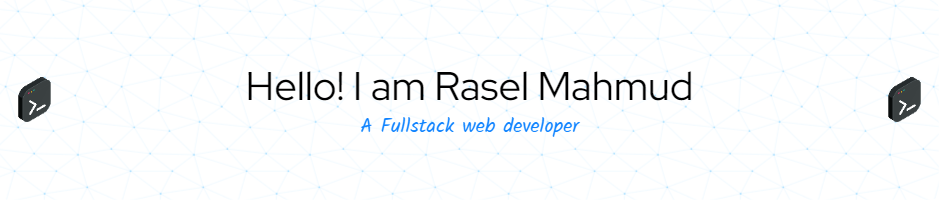
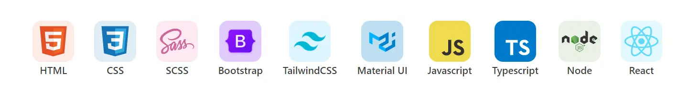
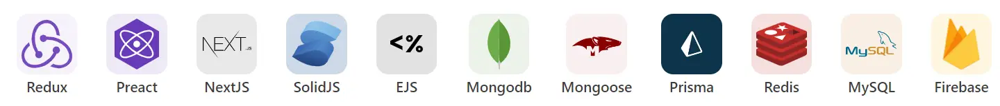
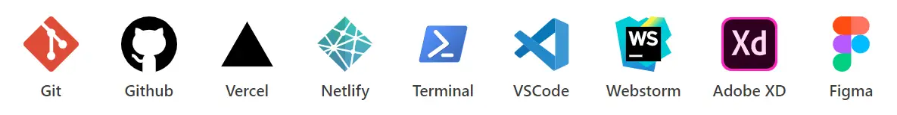

<!---
rasel-mahmud-dev/rasel-mahmud-dev is a ✨ special ✨ repository because its `README.md` (this file) appears on your GitHub profile.
You can click the Preview link to take a look at your changes.
--->

---
### 📕 Skills
### Language and Framework

### Tools

---

### 📕 Random Small code snippet and projects

---

### 📕 Latest Blog Posts

<!-- BLOG-POST-LIST:START -->
<!-- BLOG-POST-LIST:END -->

➡️ [কিভাবে রিয়াক্ট এর Context API, useReducer, Custom Hooks দ্বারা Redux এর মতো state ম্যানেজ করতে পারি](https://rasel-portfolio.vercel.app/blogs/%E0%A6%95%E0%A6%BF%E0%A6%AD%E0%A6%BE%E0%A6%AC%E0%A7%87-%E0%A6%B0%E0%A6%BF%E0%A7%9F%E0%A6%BE%E0%A6%95%E0%A7%8D%E0%A6%9F-%E0%A6%8F%E0%A6%B0-Context-API-useReducer-Custom-Hooks-%E0%A6%A6%E0%A7%8D%E0%A6%AC%E0%A6%BE%E0%A6%B0%E0%A6%BE-Redux-%E0%A6%8F%E0%A6%B0-%E0%A6%AE%E0%A6%A4%E0%A7%8B-state-%E0%A6%AE%E0%A7%8D%E0%A6%AF%E0%A6%BE%E0%A6%A8%E0%A7%87%E0%A6%9C-%E0%A6%95%E0%A6%B0%E0%A6%A4%E0%A7%87-%E0%A6%AA%E0%A6%BE%E0%A6%B0%E0%A6%BF)
 
➡️ [Authentication System Node.js App using Passport.js, and MongoDB Google Login](https://rasel-portfolio.vercel.app/blogs/authentication-system-nodejs-app-using-passportjs-and-mongodb-google-login)
 
➡️ [What is Go](https://javascript-refresh.vercel.app/golang/what-is-go)
 
➡️ [Automatic Batching in react v18 new feature](https://rasel-portfolio.vercel.app/blogs/react-automatic-batching-in-react-v18)
 
➡️ [more blog posts...](https://rasel-portfolio.vercel.app/blogs)

---

### 📕 Npm Packages

---

### Contribution Graph📚

### Stats summary📈

 
  

 

### Connect with me

[][website]
[][linkedin]
[][instagram]

 
 

<!-- This like variable -->
[website]: https://rasel-portfolio.vercel.app
[instagram]: https://instagram.com/rasel-mahmud-dev
[linkedin]: https://linkedin.com/in/rasel-mahmud-dev

